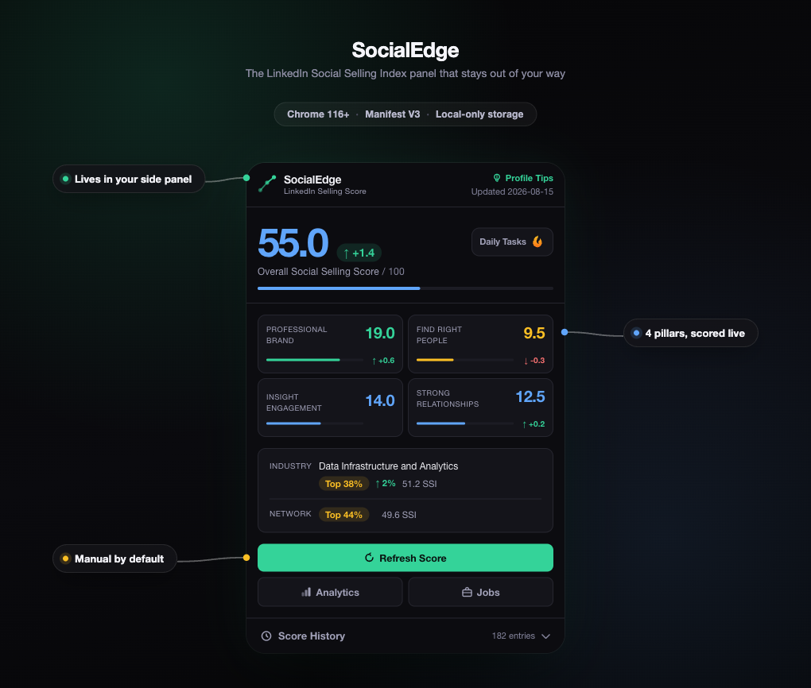

# SocialEdge

SocialEdge is a Chrome 116+ side-panel extension for LinkedIn SSI history, analytics, profile tips, job suggestions, activities, and daily tasks. You control LinkedIn access from the panel. A new install, extension startup, upgrade, or alarm does not use your LinkedIn session unless you enable the SSI-only automatic refresh setting.

## Preview

The side panel opens next to any open LinkedIn tab. The screenshot below is a mocked example, not data from a real account. [`docs/marketing/`](docs/marketing/) holds the source: `panel.html` renders the real `extension/popup.css` with a fabricated dataset, and `hero.html` composes it into the shot below.



The Analytics, Profile Tips, Jobs, and Daily Tasks screens use the same mocked account:

| Screen | Example data |
|---|---|
| Analytics | 812 followers, 47 profile views this week, 6 search appearances |
| Profile Tips | 62% complete, 3 open tips (add a featured post, request two more skill endorsements, finish the summary section) |
| Jobs | 10 matching roles, for example "Senior Data Analyst, Acme Corp (Remote)" |
| Daily Tasks | 2 of 5 tasks completed today |

## Install

1. Clone or download this repository.
2. Open `chrome://extensions` in Chrome and enable Developer mode.
3. Select **Load unpacked** and choose the `extension/` directory.
4. Sign in to LinkedIn in the same Chrome profile.
5. Open the SocialEdge side panel and choose a feature.

The repository also has a release packager:

```bash
npm ci
npm run package:extension
```

The packager writes its allowlisted output to `dist/socialedge-extension/`. It excludes tests, fixtures, the development server, databases, dormant content scripts, and account-authentication code.

## Export

Export your score and activity history as JSON from the side panel or the History screen, then analyze trends with the included script:

```bash
python3 analysis/analyze_ssi.py socialedge_YYYY-MM-DD.json --lags 0 1 2 3 --output ssi-analysis.json
```

## Test

```bash
npm run test:unit
npm run test:extension
npm run test:release
python3 -m unittest discover -s analysis -p 'test_*.py'
node --check extension/background.js
node --check extension/popup.js
```

The controlled Chrome tests use fixtures and an isolated profile. They do not require a personal LinkedIn account. Use a dedicated test account for the final live smoke matrix and keep credentials, headers, raw responses, page text, and personal screenshots out of logs.

## Troubleshooting

- **Account verification error:** Sign in at `https://www.linkedin.com/` in the same Chrome profile, then start the feature again.
- **Session expired:** Sign in to LinkedIn again. SocialEdge already removed the rejected request context.
- **Account changed:** Start a fresh manual collection. SocialEdge cleared prior bound data and disabled automatic refresh.
- **No context:** Keep Chrome able to create an inactive LinkedIn tab. The collector will not repurpose another tab.
- **Temporary tab closed or timeout:** Retry the feature. The previous valid snapshot remains available.
- **Automatic refresh did not run:** Check the switch in About. Missing or outdated consent stays disabled.
- **PDF download:** Open About and select **Free Boost Strategy PDF**. The PDF remains an extension-owned resource and is not exposed to websites.

## Learn more

- **Privacy and data handling**: exactly what SocialEdge reads, stores, and deletes, plus the Chrome permissions it requests. See [extension/PRIVACY_POLICY.md](extension/PRIVACY_POLICY.md).
- **Architecture**: code layout and how the service worker processes a request. See [docs/architecture.md](docs/architecture.md).
- **SocialEdge account authentication**: why it stays disabled in release builds and what a future reviewed release must satisfy first. See [server/README.md](server/README.md).

## Credits

[Artyom Rudman](https://github.com/artemrudman) created SocialEdge ([original repository](https://github.com/artemrudman/socialedge)). [Artsiom Kharytonchyk](https://github.com/AKharytonchyk) maintains this fork under the same [MIT License](LICENSE).
